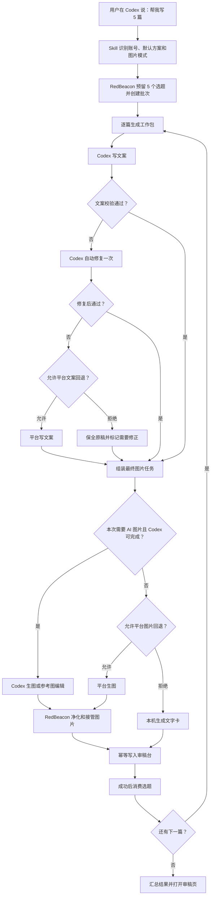
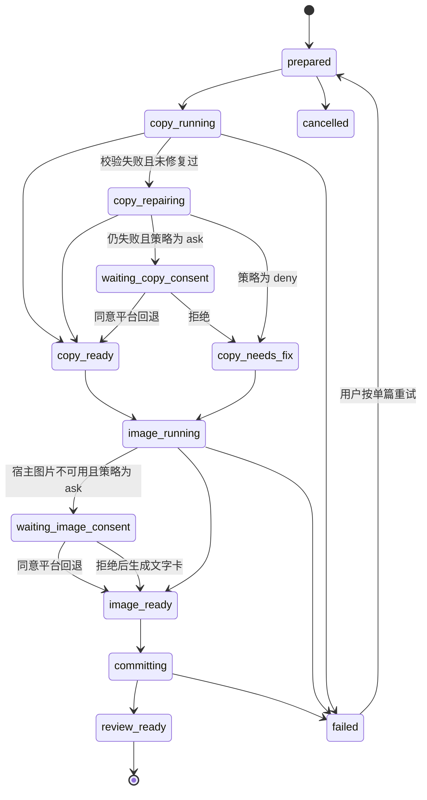
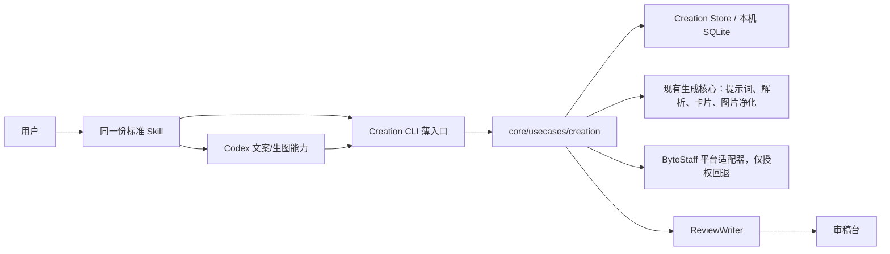

# RedBeacon 宿主 AI 创作与 Skill 自动化开发蓝图

> 版本：0.1
> 日期：2026-08-14
> 状态：产品决策已确认，阶段 0～6 已通过；下一步进入阶段 7 测试版发布前验收
> 首发宿主：Codex
> 业务数据：当前通道本机 SQLite；正式版与测试版继续严格隔离
> 阶段 0 实证：[Codex 图片交付技术验证](technical-spikes/codex-image-handoff-2026-08-14.md)

## 1. 一页产品定义

### 1.1 要解决的问题

当前 RedBeacon Skill 把文案和 AI 图片强制交给 ByteStaff 平台生成。这样虽然统一，但有三个直接问题：

1. 已经在 Codex 中工作的用户仍需重复消耗 RedBeacon 算力点，没有利用宿主已有的写作和生图能力。
2. 用户说“帮我写一篇”后，仍需频繁挑账号、挑题、挑方案、确认配图，自动化感不足。
3. 现有“自主添加笔记”只解决了 UI 手工上传，没有一条供宿主安全写入、可追踪、可重试且不会重复入审的正式协议。

### 1.2 产品目标

让用户在 Codex 中用一句自然语言完成：

**识别账号 → 自动挑题和方案 → Codex 写文案 → Codex 生图或安全回退 → 写入审稿台 → 打开审稿页**。

全程不自动通过、不自动发布；只要要消耗 RedBeacon 平台算力点，就先遵守该账号、该能力的授权策略。

### 1.3 成功标准

- 单账号已配置、库存选题充足时，用户说“帮我写一篇”，中途无需回答即可看到审稿成稿。
- Codex 文案与 Codex 图片都成功时，RedBeacon 平台 AI 调用次数为 0、算力点消耗为 0。
- 未得到明确授权时，平台文案和平台图片调用次数必须为 0。
- 同一 `generation_id` 被重复提交时，只产生一条审稿记录。
- 失败的创作不消费选题；成功入审后才消费选题。
- 任何进入审稿台或发布链路的外部图片都经过现有图片净化流程。
- 批量 1～20 篇严格串行；单篇失败不阻断后续，最终给出逐篇结果。
- 标题超过 20 字、正文超过 888 字、图片为 0 或稿件仍标记“需要修正”时，不能通过审核。

### 1.4 明确不做

- 桌面客户端不启动、控制或等待 Codex，也不调用 Codex CLI。
- 不自动通过审稿，不自动发布。
- 不提供后台常驻生成服务。
- 第一版不为 OpenClaw、Hermes、WorkBuddy、Claude Code 分别维护不同 Skill 正文。
- 不为某个宿主复制第二套业务协议；五宿主按当前会话真实可调用能力逐项选择宿主或平台。
- 不让用户提供或保存上游模型 Key。
- 不恢复飞书审核主链路；验收以本机数据源为准。

## 2. 用户与入口

| 用户/入口 | 文案来源 | 图片来源 | 是否可能消耗平台点数 | 结果去向 |
|---|---|---|---|---|
| Codex 中调用 Skill | Codex 优先 | Codex 优先；不可用时按策略回退平台或本机文字卡 | 仅获得对应能力授权后 | 审稿台 |
| 其它 AI 助手中调用 Skill | 宿主优先；宿主无法可靠交付时回退平台 | 宿主有可靠生图能力则优先；否则按策略回退平台或本机文字卡 | 仅实际使用平台能力时 | 审稿台 |
| RedBeacon 客户端“生成”页 | RedBeacon 平台 | RedBeacon 平台或本机卡片 | 是，点击前显示预计消耗 | 审稿台 |
| RedBeacon 客户端“自主添加笔记” | 用户提供 | 用户上传 | 否 | 审稿台 |

宿主 AI 是架构抽象，Codex 默认启用自身文案能力；其它受支持助手按其当前会话暴露的真实能力使用同一协议。核心业务协议不得出现“必须是 Codex 才能解析”的字段，来源值可以记录 `codex` 或 `other_host`。

## 3. 已确认的产品规则

### 3.1 默认代理规则

用户没有指定细节时，Skill 自动完成以下选择：

1. 账号只有一个时直接使用；多个账号且可从上下文可靠判断时直接使用。
2. 不能可靠判断账号时，只问一次账号选择。
3. 选题优先使用用户明确指定的题；否则自动选择最高优先级且适合默认方案的未使用选题。
4. 方案优先使用用户明确指定的方案；否则使用账号默认方案。
5. 配图方式优先使用用户本次明确要求；否则使用方案或账号默认值。
6. 用户说“写 5 篇”时自动选择 5 个不同选题，按顺序逐篇执行。

### 3.2 平台回退授权

每个账号分别保存两项策略：

- 文案平台回退：`ask` / `allow` / `deny`
- 图片平台回退：`ask` / `allow` / `deny`

语义如下：

| 值 | 行为 |
|---|---|
| `ask` | 本次确实需要平台能力时询问；用户可只同意本次，也可同意并记住 |
| `allow` | 后续同类回退可以直接使用平台，但仍记录来源和点数 |
| `deny` | 不调用该平台能力，直接执行无付费替代路径 |

文案和图片授权互不连带。账号 A 的授权不能用于账号 B。设置页和 Skill 都能把任一项恢复为“每次询问”。

### 3.3 文案失败与修复

1. 当前 AI 宿主首次输出必须通过和平台文案相同的 `redbeacon_copy_v1` 结构校验。
2. 允许本机执行白名单、确定性、幂等的格式归一化；禁止本机做语义改写。
3. 输出超长、缺字段或结构损坏时，把具体问题和修复要求交给当前宿主自动修复一次。
4. 第二次仍不合格时：
   - `allow`：调用平台文案生成。
   - `ask`：询问用户是否使用平台文案。
   - `deny` 或用户拒绝：保留可恢复的原始稿，写入审稿台并标记“需要修正”。
5. “需要修正”的稿件可查看、编辑和保存，但在完成一次有效人工保存前不能通过。

对完全无法解析的输出，只允许确定性保全：标题使用选题快照生成的安全标题，正文保存宿主原始文本；不得把本机兜底伪装成合格的 AI 成稿。

### 3.4 图片失败与回退

1. `cards` 模式直接使用本机文字卡，不要求宿主生图。
2. `ai` / `both` / 带货图片任务优先交给当前宿主的真实生图能力；带货任务需要宿主支持参考图编辑。
3. 当前宿主没有对应图片能力、图片工具失败、返回文件不可导入或净化失败时，按图片平台回退策略处理。
4. 用户拒绝平台图片，或策略为 `deny` 时，自动生成本机文字卡，保证至少有一张可发布图片。
5. 图片回退不能改变文案来源；来源信息必须逐组件记录。
6. 任一外部图片进入业务目录前，必须解码、处理 EXIF 方向、转换 sRGB、清除全部元数据并重写 PNG。失败即丢弃，禁止保存原始字节。

### 3.5 审稿与发布

- 创作完成后自动预审，并通过本机安全深链把客户端置前到对应账号的审稿页。
- 不自动点击“通过”，不自动进入发布任务。
- 通过前硬校验：标题 1～20 字、正文 1～888 字、至少 1 张图片、没有未解除的阻断问题。
- 审稿页显示简洁来源，例如：
  - `Codex文案 + Codex图片`
  - `Codex文案 + 平台图片`
  - `Codex文案 + 本机文字卡`
  - `平台生成`
  - `平台文案 + 本机文字卡`
- 模型名、尝试次数、回退原因、点数、错误码只在诊断详情显示。
- AI 生成声明由实际来源元数据推导。系统生成的稿件不能用一个隐藏开关伪装为非 AI；完全由用户自主添加的笔记继续按自主内容处理。

### 3.6 批量规则

- 单批 1～20 篇，严格 FIFO 串行。
- 每篇均独立执行文案、图片、预审、导入和选题消费。
- 某篇失败时保留错误记录和短期选题预留，继续下一篇；用户重试、放弃或恢复期结束后再决定消费或释放，不能让另一批立刻重复选中。
- 批量完成后只打开一次审稿页，汇总成功、需要修正、失败和未执行数量。
- 可按单篇 `generation_id` 重试；重试不影响已成功项目。

## 4. 端到端用户旅程



## 5. 业务对象与状态

### 5.1 新增业务对象

#### CreationBatch

一批由同一句用户请求产生的创作任务。

关键字段：

- `batch_id`：UUID，跨 CLI/Skill 重试稳定。
- `account_id`
- `requested_count`：1～20。
- `status`：`prepared/running/completed/completed_with_errors/cancelled`。
- `entrypoint`：`codex_skill/other_skill/desktop`。
- `created_at/updated_at/completed_at`
- 聚合计数和最终摘要。

#### CreationItem

一篇笔记的持久任务，也是幂等和诊断边界。

关键字段：

- `generation_id`：UUID，唯一。
- `batch_id`、`sequence`、`account_id`
- `status`
- `topic_record_id`、`topic_snapshot_json`
- `plan_id`、`plan_snapshot_json`
- `profile_snapshot_json`
- `request_json`、`prompt_bundle_json`
- `host_result_json`
- `source_meta_json`
- `preflight_issues_json`
- `review_record_id`
- `copy_repair_count`、`platform_copy_attempts`、`platform_image_attempts`
- `error_code`、`error_message`
- `created_at/updated_at/committed_at`

#### TopicReservation

防止批量任务或两个前台入口选中同一题。

- `(account_id, topic_record_id)` 在有效预留期间唯一。
- 预留有恢复租约；任务成功、用户放弃或取消时显式结束，失败后在恢复期内继续保留供单篇重试。
- 只有审稿记录创建成功后才真正删除/消费选题。
- 清理过期预留前必须确认没有活跃任务，不能按时间直接删正在运行的任务。

#### AccountCreationPolicy

账号级 Skill 回退策略。

- `account_id` 主键
- `copy_fallback_policy`
- `image_fallback_policy`
- `updated_at`

### 5.2 CreationItem 状态机



状态转换必须由核心用例校验，Skill 不能通过改 JSON 跳过授权、修复次数或预审。

## 6. 架构与模块边界

### 6.1 总体边界



核心原则：

- UI、CLI、Skill 都调用同一组核心用例，不复制业务规则。
- `core/usecases/generate.py` 中可复用逻辑拆成纯准备、纯校验和有副作用提交三段。
- 平台 `Copywriter` / `CoverImageMaker` 保留为适配器，不再被核心端口文档定义成唯一实现。
- Skill 负责调用宿主能力和处理人机对话；它不直接写数据库、不自己复制图片到业务目录。
- 客户端“生成”入口继续直接调用平台适配器，不反向依赖 Skill。

### 6.2 建议核心用例

新增 `cli/src/redbeacon/core/usecases/creation.py`：

- `prepare_batch(request)`：解析账号、挑选并预留选题、建立批次。
- `prepare_item(generation_id)`：加载快照并生成宿主工作包，不调用 AI、不扣点。
- `validate_host_copy(generation_id, host_result)`：规范化、解析、校验，返回通过或一次性修复说明。
- `record_copy_consent(...)` / `record_image_consent(...)`：记录本次选择及是否更新账号策略。
- `prepare_image_tasks(generation_id)`：基于已验证文案生成最终图片任务。
- `commit_host_result(generation_id, result)`：校验来源、导入和净化图片、渲染卡片、预审、幂等入审、消费选题。
- `retry_item(generation_id)`：只重置允许重试的阶段并保留诊断历史。
- `get_batch_summary(batch_id)`：给 Skill 和 UI 返回统一摘要。

现有 `generate.py` 调整为共享积木：

- 保留并复用 `render_copy_prompt`。
- 把图片最终提示词构造从平台适配器中抽成无网络纯函数。
- `parse_copy` 继续作为平台和宿主共同的入站规范化真源。
- `render_from_draft` 拆分“获得平台图片”和“接管已有图片 + 渲卡 + 入审”，避免宿主提交时误调用平台。
- 现有桌面一把梭路径改为组合相同积木，行为保持不变。

### 6.3 端口调整

在 `core/ports.py` 中新增或调整：

- `CreationStore`：批次、单篇、状态转换、幂等查询。
- `CreationPolicyStore`：账号级文案/图片回退策略。
- `TopicReservationStore`：原子预留、释放、消费。
- `CreationCommitPort`：在本机数据源中用同一事务幂等创建审稿行并消费对应预留选题。
- `ExternalImageImporter`：从受控收件箱读取、净化、原子落盘。
- `Copywriter` 和 `CoverImageMaker` 的说明改为中性“AI 适配器”，平台只是现有实现。

不要为 Codex 写一个会被客户端注入的 `CodexCopywriter`。Codex 位于进程外，由 Skill 通过工作包协议协作。

## 7. 宿主工作包协议

### 7.1 原则

- 协议版本化、宿主中立、可离线验证。
- 中文、多行、嵌套 JSON 只走 UTF-8 文件或 stdin，不放进长命令行参数。
- CLI 创建当前通道拥有的工作目录，并返回精确路径；Skill 不自行猜 `~/.redbeacon` 或 `~/.redbeacon_test`。
- 宿主只能把结果写入该任务的受控收件箱；commit 端重新校验任务归属、文件类型、大小、真实路径和图片内容。
- `generation_id` 是所有阶段的幂等键。

### 7.2 `redbeacon-creation-work/v1`

建议结构：

```json
{
  "schema": "redbeacon-creation-work/v1",
  "generation_id": "uuid",
  "batch_id": "uuid",
  "sequence": 1,
  "account": {"id": 8, "display_name": "宠物出行客户"},
  "topic": {"record_id": "42", "snapshot": {}},
  "plan": {"id": 3, "name": "默认方案", "snapshot_hash": "sha256:..."},
  "copy_task": {
    "system_prompt": "...",
    "user_prompt": "...",
    "output_contract": "redbeacon_copy_v1",
    "repair_limit": 1
  },
  "image_intent": {
    "mode": "both",
    "required_capability": "image_generate",
    "reference_images": []
  },
  "paths": {
    "result_file": "由 CLI 分配的绝对路径",
    "asset_inbox": "由 CLI 分配的绝对路径"
  }
}
```

工作包包含生成时所需快照，但不包含平台令牌、Cookie、代理密码或其它账号秘密。

### 7.3 `redbeacon-host-result/v1`

```json
{
  "schema": "redbeacon-host-result/v1",
  "generation_id": "uuid",
  "host": {"id": "codex", "capabilities": ["copy", "image_generate"]},
  "copy": {
    "attempt": 1,
    "raw_output": "{...redbeacon_copy_v1...}"
  },
  "images": [
    {"task_id": "cover", "path": "受控收件箱中的文件", "kind": "generated"}
  ]
}
```

宿主自报来源只作为诊断输入，最终来源由 RedBeacon 根据实际执行阶段写入，不能让传入 JSON 把平台结果伪装成 Codex 结果。

### 7.4 CLI 表面

建议新增顶级命令组 `creation`，保留现有 `generate` 作为桌面/平台兼容入口：

- `creation batch-prepare --json-file <request.json>`
- `creation item-prepare --generation-id <id>`
- `creation copy-validate --generation-id <id> --json-file <host-result.json>`
- `creation image-prepare --generation-id <id>`
- `creation commit --generation-id <id> --json-file <host-result.json>`
- `creation retry --generation-id <id>`
- `creation fail --generation-id <id> --json-file <failure.json>`
- `creation cancel --generation-id <id>`
- `creation batch-recover --batch-id <id>`
- `creation batch-cancel --batch-id <id>`
- `creation cleanup-expired`
- `creation batch-status --batch-id <id>`
- `creation policy get --account-id <id>`
- `creation policy set --account-id <id> --json-file <policy.json>`

所有成功结果走 stdout JSON，进度走 stderr JSON，错误保持 `{error, code, next}`。命令不得要求平台登录，除非当前状态机已经选择并授权了平台回退。

## 8. 自动选题、方案和能力判断

### 8.1 选题选择顺序

1. 用户明确指定的 `record_id`。
2. 用户明确描述且能唯一匹配的库存选题。
3. 未预留的库存题按以下顺序排序：高优先级、时效性、信息完整度、默认方案类型适配度、较早入库。
4. 对排名靠前的候选，Skill 可结合最近已写标题判断重复度；不能可靠判断时使用确定性排序第一条，不再让用户挑。

批量选择必须在一个本机事务里预留 N 条，不能先读列表再逐条裸取。

### 8.2 宿主能力判断

标准 Skill 正文保持五宿主同字节，运行时按当前宿主实际能力选择路线：

- Codex 默认启用自身文案能力；其它宿主确认能执行文案任务并完成本机 JSON 交接时，也启用宿主文案。
- 能调用生图能力并能把结果交付为本机资产：启用 `image_generate`。
- 能带参考图编辑：启用 `image_edit`，用于带货方案。
- 无法可靠确认某项能力：不得假装成功，只让该能力进入平台或本机替代路径；不能连带重做已由宿主完成的其它能力。

第一阶段必须先完成“Codex 生图结果如何稳定落为 CLI 可接管的本机文件”的技术验证。验证失败时，不能以复制聊天中的临时 URL 作为正式实现。

## 9. 数据库与审稿模型改造

### 9.1 新表

建议新增：

- `creation_batch`
- `creation_item`
- `creation_topic_reservation`
- `account_creation_policy`

迁移必须幂等，旧库启动后不改变已有生成、审稿和发布记录。

### 9.2 `local_review` 新字段

- `generation_id TEXT`
- `origin TEXT`：`manual/desktop/codex_skill/other_skill`
- `source_meta TEXT NOT NULL DEFAULT '{}'`
- `preflight_issues TEXT NOT NULL DEFAULT '[]'`
- `needs_fix INTEGER NOT NULL DEFAULT 0`
- `is_ai_generated INTEGER`：`1/0/NULL`，系统生成必须为确定值

`generation_id` 建唯一索引但允许旧记录为空。`local_archive` 同步保存来源和 AI 声明，发布归档不能丢失审计信息。

### 9.3 来源元数据

建议结构：

```json
{
  "copy": {"provider": "codex", "attempts": 2, "fallback_reason": ""},
  "images": [
    {"provider": "platform", "kind": "cover", "points_cost": 8}
  ],
  "cards": {"provider": "local", "count": 3},
  "total_points_cost": 8
}
```

审稿列表只返回派生后的简洁标签；诊断接口按需返回完整元数据。

## 10. UI 改造

### 10.1 账号管理：AI 创作方式

在每个账号卡片增加可展开的“AI 创作方式”，文案和图片分开：

- 文案：AI 助手里优先使用当前助手；助手失败时 `每次询问 / 允许平台回退 / 不使用平台`。
- 图片：AI 助手里优先使用当前助手；助手无生图能力时 `每次询问 / 允许平台回退 / 只用本机文字卡`。
- 显示一句边界说明：“客户端内点击生成仍由 RedBeacon 平台完成。”

自然语言设置与 UI 调同一用例，例如“这个号以后 Codex 画不了图就直接用文字卡”。

### 10.2 客户端生成页

- 继续只走 RedBeacon 平台。
- 用户点击前按本次模式显示“预计使用平台文案 1 次 / 图片 N 张”，无法精确点数时显示能力次数，不虚构点数。
- 开始后沿用现有严格串行队列。
- 不显示“正在连接 Codex”，因为客户端没有该能力。

### 10.3 审稿页

- 标题附近增加来源胶囊和“AI 生成声明”状态。
- `needs_fix=1` 时显示具体阻断问题和“保存修改后重新预审”。
- 来源详情默认折叠；展开后可看回退原因和点数，但不暴露提示词、令牌或本机敏感路径。
- Skill 批量完成深链进来时，优先定位/高亮本批新增记录；无法高亮时至少定位到正确账号。
- 现有增删改图片、标签回车录入、标题/正文/图片预审继续复用。

### 10.4 发布页

- Skill/平台系统生成记录的 AI 声明只读显示，由来源推导。
- 自主添加的旧记录保持兼容，不在本次改造中批量改写历史声明。
- 进入真实提交前再次执行标题、正文、图片数量和阻断状态校验，不能只信审稿时结果。

## 11. 安全、可靠性与兼容性

### 11.1 安全

- 工作目录固定在当前通道数据目录下，不接受用户 JSON 指定任意输出目录。
- 图片路径必须解析真实路径、拒绝符号链接越界、限制扩展名/字节数/像素数，并使用 `image_sanitize.py`。
- 只保存净化后的 PNG；原始宿主图片最多存在于受控收件箱，提交后清理。
- 工作包不含平台令牌、小红书 Cookie、代理凭据。
- 提示词和宿主结果只存在本机；诊断导出默认脱敏本机绝对路径。

### 11.2 可靠性

- 所有状态变化和幂等检查在核心用例中完成。
- `commit` 先校验全部文案与图片，再开始写业务表；部分图片成功不能保存成假完整结果。
- 审稿写入成功与选题消费需要由 `CreationCommitPort` 在同一 SQLite 事务完成，不能让两个各自开连接的端口假装原子；如果暂时保留远端数据源兼容，则必须用补偿记录保证失败后可恢复。
- 崩溃恢复后从持久状态继续，不能重复调用已经成功且可能扣点的平台请求。
- 平台回退继续遵守现有 `request_id` 幂等、账号级 AI 调度器、Retry-After 和熔断规则。

### 11.3 通道与平台兼容

- 正式版只读写 `~/.redbeacon`；测试版只读写 `~/.redbeacon_test`。
- 工作包记录构建通道，另一通道不能提交。
- Windows PowerShell 5.1、GBK 控制台、中文路径、空格路径必须进入测试矩阵。
- Skill 源只改 `.claude/commands/redbeacon-generate.md` 等真源，再由 `tools/build_channel_skills.py` 生成正式/测试、五宿主包；不得手改安装目录副本。

## 12. 分阶段实现任务

### 阶段 0：Codex 能力技术验证（阻断项）

改动/产物：技术验证脚本、离线夹具、结论记录。

- 验证 Codex 当前宿主身份和文案能力如何被 Skill 可靠识别。
- 验证生图结果能否稳定得到本机文件；验证参考图编辑。
- 验证生成文件能被 CLI 收件箱接管并净化。
- 明确失败时的能力缺失信号，不能靠解析自然语言错误猜测。

验收：普通生图和参考图编辑至少各有一条真实闭环；若参考图编辑不可用，带货图片明确进入平台询问/文字卡路径。

### 阶段 1：领域模型、迁移和持久任务

主要文件：

- `cli/src/redbeacon/database.py`
- `cli/src/redbeacon/core/domain.py`
- `cli/src/redbeacon/core/ports.py`
- `cli/src/redbeacon/infra/creation.py`（新增）
- `cli/src/redbeacon/composition.py`

任务：新增批次、单篇、预留、账号策略、来源和幂等存储；建立合法状态转换。

验收：旧库幂等升级；重复 `generation_id` 不重复入审；两个任务不能预留同一题。

完成记录（2026-08-14）：已加入批次/单篇状态机、账号级文案与图片 fallback 策略、
带租约的选题预留、审稿/归档来源字段，以及“入审 + 消费选题 + 释放预留 + 完成任务”
单事务提交。相关测试与 CLI 全量回归共 710 项通过。

### 阶段 2：拆分生成核心

主要文件：

- `cli/src/redbeacon/core/usecases/generate.py`
- `cli/src/redbeacon/core/usecases/creation.py`（新增）
- `cli/src/redbeacon/core/presets.py`
- `cli/src/redbeacon/services/image_sanitize.py`

任务：抽出准备提示词、宿主文案校验、最终图片任务、外部图片接管、审稿提交；平台路径改用同一积木。

验收：现有平台生成测试不回归；同一提示词输入在桌面和 Skill 准备阶段得到同一结果；宿主提交阶段不会意外调用平台。

完成记录（2026-08-14）：已加入版本化宿主工作包、一次文案修复校验、最终图片任务、
受控收件箱与无元数据 PNG 接管、本机文字卡回退和宿主幂等入审；桌面平台生成已经复用
同一份提示词准备、最终封面提示词和图片组装逻辑。宿主提交用例不接收平台文案/生图端口，
并用测试将平台调用替换为硬失败后仍可完整入审。CLI 全量回归 719 项通过。

### 阶段 3：Creation CLI 协议

主要文件：

- `cli/src/redbeacon/cli.py`
- `cli/src/redbeacon/routers/creation.py`（新增）
- `cli/tests/test_cli_creation.py`（新增）

任务：实现工作包、校验、图片任务、提交、策略、批次状态和单篇重试命令。

验收：所有嵌套输入走 JSON 文件/stdin；stdout/stderr 合约稳定；没有平台登录时宿主文案 + 本机文字卡零点路径完整成功。

完成记录（2026-08-14）：已实现 `batch-prepare`、`item-prepare`、`copy-validate`、
`image-prepare`、`commit`、`retry`、`fail`、`cancel`、`batch-recover`、`batch-cancel`、
`cleanup-expired`、`batch-status` 与账号级 `policy get/set` 协议；
工作包、宿主收图箱和结果文件均位于按 `generation_id` 隔离的受控目录。嵌套载荷优先使用
UTF-8 JSON 文件或 stdin，业务结果只写 stdout，进度与机器错误写 stderr；整条 Codex 文案 +
本机文字卡路径在平台登录检查被硬阻断时仍可成功入审。批次和单篇 ID 支持幂等重放，跨任务
结果会被拒绝，删账号与 JSON 备份也已覆盖创作任务数据和受控文件。CLI 全量回归 723 项通过。

### 阶段 4：Codex Skill 编排

主要文件：

- `.claude/commands/redbeacon-generate.md`
- `.claude/commands/redbeacon.md`
- 必要时调整 review/strategy 命令真源
- `tools/build_channel_skills.py`
- Skill 打包/字节一致性测试

任务：把当前“宿主不得写文案”的规则替换为能力路由；实现一次修复、授权询问、批量串行、结果汇总和审稿深链。

验收：五宿主仍消费同一正文；Codex 默认使用自身文案/生图，其他宿主按实际能力逐项使用，缺失项回退平台或本机能力；测试版命令、数据目录、manifest 全部正确转换。

完成记录（2026-08-14）：生成 Skill 真源已改为运行时能力路由：Codex 使用版本化工作包写文案、
只自动修复一次、调用内置生图并把本机结果送入受控收件箱；其它宿主能可靠执行工作包时复用
同一宿主中立协议，缺少生图能力时只让图片回退平台或本机文字卡，文案不重复走平台。
新增文案/图片 `copy-fallback` 与 `image-fallback` 授权命令，`ask` 状态在用户明确决定前不会
调用平台，`allow` 才调用平台，`deny` 分别保全待修稿或生成本机文字卡。批量按稳定 ID 严格
串行，成功后只打开一次审稿页，不自动通过或发布。主入口已放开宿主零平台登录路径，
正式/测试 Skill 派生、五宿主矩阵、标准 Skill 校验和 CLI 全量回归 727 项全部通过。

### 阶段 5：账号设置、来源和审稿体验

主要文件：

- `cli/src/redbeacon/adapters/ui_backend/app.py`
- `cli/src/redbeacon/adapters/ui_backend/static/index.html`
- `cli/src/redbeacon/core/usecases/review.py`
- `cli/src/redbeacon/infra/local_data.py`
- `cli/tests/test_ui_review.py`

任务：账号级策略 UI/API、来源胶囊、需要修正状态、诊断详情、批次高亮、AI 声明派生。

验收：两项策略独立保存；账号隔离；无图/超长/needs_fix 均不能通过；人工有效保存后可解除 needs_fix。

完成记录（2026-08-14）：账号管理页已加入按账号、按能力独立保存的文案/图片平台接力策略，
默认均为需要时询问；审稿页显示 Codex、平台、本机文字卡与用户自主添加等组件来源、诊断详情、
同批创作序号和平台算力点数。宿主待修稿会在 UI 和核心用例双重阻止直接通过，完成一次有效
保存后才解除。发布页会从本机审稿来源派生 AI 生成声明：系统生成稿自动开启且客户端无法关闭，
自主添加稿默认关闭但可按实际情况调整。Chrome 常规桌面宽度与 760px 小屏视觉检查通过，策略
真实切换、刷新持久化和待修稿拦截均已手测；前端语法、发布合同和 CLI 全量回归 732 项全部通过。

### 阶段 6：批量、崩溃恢复与完整回归

任务：1～20 篇 FIFO、失败继续、失败预留恢复租约、取消/过期释放、逐篇重试、最终摘要。

验收：5 篇中第 3 篇失败时，第 1/2/4/5 篇仍可入审；第 3 篇选题仍可用；完成后只打开一次审稿页。

完成记录（2026-08-14）：新增 `fail`、`retry`、`cancel`、`batch-cancel`、`batch-recover`
与过期租约回收协议；批次预留初始覆盖 24 小时，单篇开始、失败待恢复和崩溃恢复时按状态续租。
Skill 会为不可恢复的单篇错误写入结构化失败记录并继续下一篇，恢复时按失败前阶段继续，不会把
`commit` 失败退回文案或图片生成，也不会重复已经成功且可能扣点的平台步骤。完成但含错误的批次
可用原 `generation_id` 重新打开；取消会释放未完成选题而保留已入审成稿，过期清理只回收失败或
从未开始的任务，运行中和等待用户授权的任务不会因时间到期被误删。5 篇第 3 篇失败、提交断点、
失败继续、恢复、取消和过期清理均已加入自动化测试；整批仍严格由 Skill 串行并只在收尾打开一次审稿页。
Creation 定向测试及跨宿主能力路由、CLI 全量回归 739 项与发布合同检查全部通过。

### 阶段 7：测试版发布前验收

- 完整单元/集成/UI 测试。
- macOS 源码客户端真实闭环。
- Windows x64 冻结客户端和 PowerShell 5.1 路径真实闭环。
- Skill 正式/测试五宿主共存检查。
- 先发布测试版，用户真实试用确认后才能构建和发布正式版。

## 13. 测试矩阵

| 类别 | 场景 | 预期 |
|---|---|---|
| 路由 | Codex 文案+图片均可用 | 0 平台调用，来源为 Codex 文案+Codex图片 |
| 路由 | 其它宿主能写文案、不能生图 | 文案来自宿主；只有图片按授权回退平台或文字卡 |
| 授权 | 图片策略 ask，Codex 无生图 | 询问一次，未回答前不调用平台 |
| 授权 | 文案 allow、图片 deny | 文案可回退平台，图片只能 Codex或文字卡 |
| 隔离 | 账号 A allow、账号 B ask | B 仍需询问 |
| 文案 | 首次格式错、修复后正确 | 只让当前宿主修复一次，不调用平台 |
| 文案 | 修复仍错且用户拒绝平台 | 入审为 needs_fix，原稿保全，不能直接通过 |
| 图片 | Codex 图片含 EXIF/XMP/ICC | 业务目录只出现净化后 PNG |
| 图片 | 图片损坏且拒绝平台 | 丢弃坏图，改为本机文字卡 |
| 幂等 | 同一 generation_id commit 两次 | 返回同一 review_record_id，只有一条记录 |
| 选题 | commit 前崩溃 | 选题未消费；恢复或取消后可再次使用 |
| 选题 | 审稿写入成功 | 选题恰好消费一次 |
| 批量 | 5 篇第 3 篇失败 | 1/2/4/5 继续，汇总标出第 3 篇 |
| 队列 | 请求 21 篇 | 明确拒绝，不截断后静默执行 |
| 预审 | 标题 21 / 正文 889 / 0 图 | 审稿通过和发布提交双重阻断 |
| 来源 | Codex 文案+平台图片 | 标签和 AI 声明正确，点数只记图片 |
| UI | 客户端点击生成 | 明示平台能力消耗，不出现 Codex 状态 |
| 通道 | 测试包继承正式环境变量 | 仍只写测试目录，正式数据不变 |
| Windows | 中文账号名、空格路径、GBK 终端 | 文件协议和 JSON 不损坏 |
| 恢复 | 平台回退响应未知后重启 | 按现有 request_id 语义确认，不重复扣点 |

## 14. 决策记录

| 决策 | 原因 |
|---|---|
| Skill 中宿主优先，桌面客户端平台优先 | 客户端不能可靠控制外部宿主；边界清晰且不制造后台耦合 |
| 五宿主使用同一宿主中立协议 | Codex 默认使用自身能力，其它宿主按真实能力逐项路由，避免无谓平台消耗 |
| 平台回退按账号、按能力授权 | 避免静默扣点，也避免每次重复询问 |
| 文案只自动修复一次 | 防止无限循环和不可控等待 |
| 无图片能力时用本机文字卡兜底 | 保证至少一图、可进入发布流程且不产生费用 |
| 先入审、绝不自动通过/发布 | 保留用户最终控制权，符合现有发布纪律 |
| 生成任务持久化且幂等 | 解决崩溃、重复执行、批量失败和选题丢失 |
| 来源按组件记录 | 支持混合来源、正确 AI 声明、点数审计和诊断 |

## 15. 假设、风险与待验证项

### 已采用假设

- 当前业务数据默认且主要使用本机 SQLite。
- Codex 能按工作包调用自身文案能力。
- 本机文字卡继续作为零平台图片能力的可靠兜底。
- 现有 `parse_copy`、图片净化和审稿预审可以扩展为共同真源。

### 阻断性待验证

1. Codex 生图工具能否把结果稳定交付为 RedBeacon 可读取的本机文件或受控资源。
2. Codex 参考图编辑能力在 Skill 执行环境中的输入/输出形式，尤其是 Windows。
3. 标准同字节 Skill 如何可靠识别“当前是 Codex且具备某能力”，不能依赖容易伪判的自然语言。

### 非阻断后续项

- 是否为批量任务增加 UI 中的历史批次面板。
- 是否为自主添加笔记增加显式 AI 使用声明采集；本次不改写其既有语义。

## 16. MVP 完成定义

同时满足以下条件，才算第一版完成：

1. Codex 中一句“帮我写一篇”可以零平台点数完成文案、图片/文字卡、入审和审稿深链。
2. Codex 图片不可用时，用户授权平台或拒绝后文字卡两条路都真实可用。
3. 文案损坏自动修复一次；仍失败时的付费回退和 needs_fix 保全路径都可用。
4. 账号级文案/图片回退策略可在 UI 和 Skill 中读写。
5. 批量 20 篇以内严格串行、失败继续、选题不丢、提交幂等。
6. 来源、AI 声明、点数和诊断数据一致。
7. 审稿与发布两处都执行最终预审。
8. macOS 与 Windows 测试版真实闭环通过，并由用户确认后再进入正式版发布流程。
